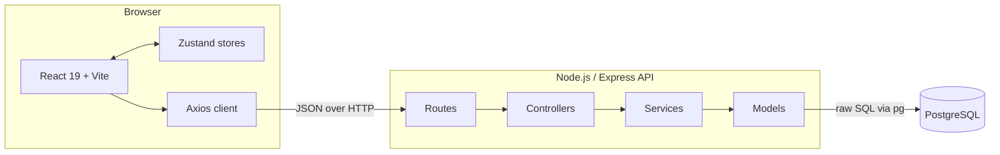
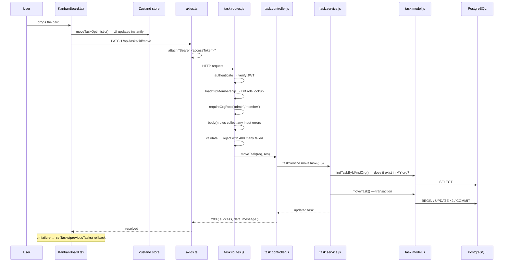
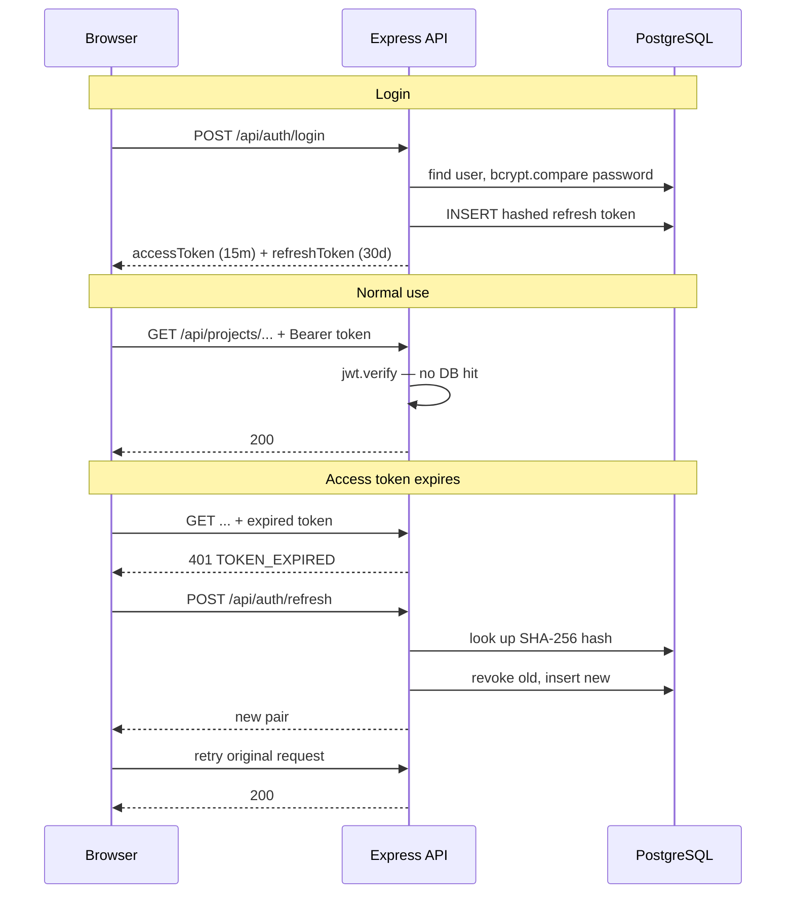
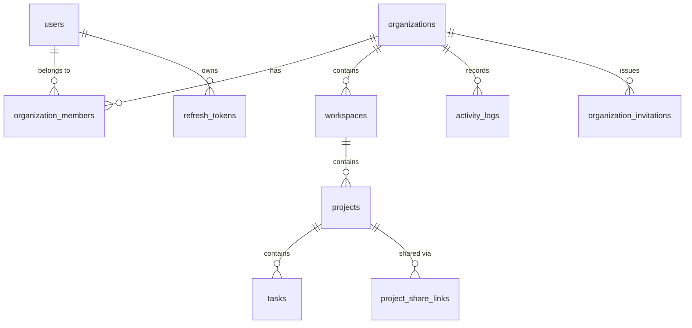

# ProjectFlow — How It Works

A plain-language walkthrough of the codebase. The README tells you how to *run* the project; this document tells you how it *works* and, more importantly, **why each decision was made** — so you can explain and defend it.

No code is duplicated here unnecessarily. Every claim points at a real file so you can open it and follow along.

---

## Table of contents

1. [What the app actually is](#1-what-the-app-actually-is)
2. [The big picture](#2-the-big-picture)
3. [The four backend layers](#3-the-four-backend-layers)
4. [Following one request end-to-end](#4-following-one-request-end-to-end)
5. [Authentication — the deep dive](#5-authentication--the-deep-dive)
6. [Multi-tenancy — how data stays separated](#6-multi-tenancy--how-data-stays-separated)
7. [RBAC — who is allowed to do what](#7-rbac--who-is-allowed-to-do-what)
8. [The Kanban board — positioning and drag-drop](#8-the-kanban-board--positioning-and-drag-drop)
9. [Optimistic UI updates](#9-optimistic-ui-updates)
10. [Public share links](#10-public-share-links)
11. [Activity logging](#11-activity-logging)
12. [The frontend, layer by layer](#12-the-frontend-layer-by-layer)
13. [The data model](#13-the-data-model)
14. [Interview questions you should expect](#14-interview-questions-you-should-expect)
15. [Known trade-offs and what I'd do next](#15-known-trade-offs-and-what-id-do-next)

---

## 1. What the app actually is

ProjectFlow is a **multi-tenant SaaS project manager** — think a small Trello or Jira.

The word that matters most is **multi-tenant**. It means one running copy of this app serves many separate companies ("organizations"), and no company can ever see another's data. That single constraint drives most of the architecture: it's why nearly every database table has an `organization_id` column, and why nearly every SQL query filters on it.

The hierarchy of data looks like this:

```
Organization  (a company — the tenant boundary)
└── Workspace     (a department or team, e.g. "Engineering")
    └── Project       (e.g. "Website Redesign")
        └── Task          (e.g. "Fix login bug")  →  lives in a Kanban column
```

Users belong to an organization through a **membership**, and that membership carries a **role**: `admin`, `member`, or `viewer`.

---

## 2. The big picture



Two separate applications talk over HTTP:

- **Frontend** — React app served by Vite. Holds no business rules; it renders state and calls the API.
- **Backend** — Express API. Holds *all* the rules. It never trusts the frontend.

That last sentence is the important one. The frontend hides the "Delete" button from a viewer, but the backend independently *refuses* the delete. The UI check is a convenience; the API check is the actual security.

---

## 3. The four backend layers

Every backend request flows through the same four layers. Each has one job, and the discipline of not mixing them is what keeps the codebase navigable.

| Layer | Directory | Job | Rule of thumb |
|---|---|---|---|
| **Routes** | `src/routes/` | Map URLs to handlers, attach middleware, validate input shape | *"What URL, who's allowed, is the input well-formed?"* |
| **Controllers** | `src/controllers/` | Translate HTTP ⇄ plain JavaScript | *"Unpack the request, call a service, format the response."* |
| **Services** | `src/services/` | Business logic and rules | *"What should happen, and in what order?"* |
| **Models** | `src/models/` | Raw SQL — nothing else | *"Talk to Postgres. No decisions."* |

### Why bother with four layers?

The honest answer for an interview: **so that each piece can change independently.**

- Swap Express for Fastify → only routes and controllers change. Services and models are untouched.
- Move from REST to GraphQL → same thing.
- Test the business logic → call the service directly, no fake HTTP request needed.

You can see the discipline holding in `src/controllers/task.controller.js`. Look at `createTask` — it reads fields off `req.body`, calls `taskService.createTask(...)`, and returns. It contains no rules about what a task *is*. All of that lives one layer down.

And in `src/models/task.model.js`, every function is a SQL query and nothing more. `moveTask` there doesn't decide *whether* a move is allowed — it just performs one.

### The shared helpers that keep the layers thin

Four small modules exist so the same boilerplate isn't retyped in every file. Knowing what each one removed is the fastest way to read the rest of the backend:

| Module | Replaces |
|---|---|
| `utils/AppError.js` | The four-line `new Error()` + `statusCode` + `code` + `throw` dance, ~25 times over |
| `middlewares/asyncHandler.js` | `catch (err) { next(err) }` at the end of every controller function |
| `middlewares/validate.js` | The four-line `validationResult` check at the top of every mutating controller |
| `utils/pickDefined.js` | The `if (x !== undefined) fields.x = x` chains in PATCH handlers |

`utils/pagination.js` and `services/activity.service.js → recordActivity` do the same job for page/limit clamping and audit writes.

**Why `asyncHandler` is necessary at all** is a good interview detail: Express 4 doesn't `await` route handlers, so an async function that throws never reaches the error handler on its own — the request just hangs. Every async controller needs *something* to bridge that gap. Doing it once in a wrapper beats doing it 25 times by hand.

### The one exception worth knowing

`src/models/task.model.js` → `moveTask()` opens its own database transaction. Transactions are arguably a service-layer concern, but the two `UPDATE` statements are so tightly coupled — shift the column, then place the task — that splitting them would be worse. Pragmatism beat purity here, and that's a fine thing to say out loud.

---

## 4. Following one request end-to-end

Let's trace one real action: **a member drags a task from "To Do" into "In Progress."**



**Follow it in the actual files:**

1. `frontend/src/components/KanbanBoard.tsx` → `handleDrop()`
2. `frontend/src/api/axios.ts` → request interceptor attaches the token
3. `backend/server.js` → routes the URL to the task router
4. `backend/src/routes/task.routes.js` → the middleware chain
5. `backend/src/controllers/task.controller.js` → `moveTask()`
6. `backend/src/services/task.service.js` → `moveTask()`
7. `backend/src/models/task.model.js` → `moveTask()` (the transaction)

Every mutating endpoint follows this exact shape. Learn one, you've learned all of them.

---

## 5. Authentication — the deep dive

This is the most technically interesting part of the project and the part most likely to be probed in an interview. It lives in `backend/src/services/auth.service.js`.

### Two tokens, two very different jobs

| | Access token | Refresh token |
|---|---|---|
| **Format** | JWT (signed, readable) | Random UUID (opaque) |
| **Lifetime** | 15 minutes | 30 days |
| **Stored in DB?** | No | Yes — as a SHA-256 **hash** |
| **Sent with every request?** | Yes | No — only to `/auth/refresh` |
| **Purpose** | Prove who you are | Get a new access token |

**Why two tokens at all?** It's a trade-off between security and database load.

A JWT is *stateless* — the server verifies the signature mathematically and never touches the database. That's fast. But it also means you **cannot revoke it**; if someone steals it, it works until it expires. So we keep its life short: **15 minutes**.

A refresh token is the opposite: it lives in the database, so it *can* be revoked instantly, but checking it costs a query. So it's used rarely — only when the access token expires.

Result: fast, stateless auth on the hot path, with a revocation escape hatch. That's the whole design.

### Why the refresh token is hashed

Look at `hashToken()` in `auth.service.js`:

```js
function hashToken(token) {
  return crypto.createHash('sha256').update(token).digest('hex');
}
```

The database stores only the hash, never the token itself. If an attacker dumps the `refresh_tokens` table, they get hashes they cannot reverse — useless for impersonating anyone.

This is the same reasoning as password hashing, with one deliberate difference: passwords use **bcrypt** (slow on purpose, to resist brute force against guessable human input), while refresh tokens use **SHA-256** (fast). That's correct, not a shortcut — a refresh token is a 128-bit random UUID, so there is nothing to guess. Brute-force resistance buys you nothing; speed matters because this runs on every refresh.

**Be ready for the follow-up:** *"Why not bcrypt everywhere?"* Answer: bcrypt's cost is a defense against low-entropy secrets. A cryptographically random UUID has no low entropy to defend.

### Token rotation

Every time you refresh, the old refresh token is **revoked** and a brand-new one is issued (`refresh()` in `auth.service.js`). A refresh token is single-use.

This shrinks the damage window. A stolen refresh token is only good until the legitimate user next refreshes — at which point the thief's copy is dead.

### Token reuse detection — the clever bit

This is the part worth memorizing. In `refresh()`:

```js
if (stored.revoked_at) {
  console.error(`⚠️  TOKEN REUSE DETECTED for user ${stored.user_id} — revoking all tokens`);
  await tokenModel.revokeAllUserTokens(stored.user_id);
  // ... throw 401
}
```

**Why does this work?** Because rotation makes each token single-use, an *already-revoked* token being presented means something is wrong. There are only two possibilities:

1. A network retry or duplicate tab (harmless), or
2. **An attacker is using a stolen token** — either the thief is replaying a token the real user already rotated, or the real user is replaying one the thief already burned.

The system can't tell (1) from (2), so it assumes the worst and **revokes every session for that user**, forcing a fresh login. Slightly annoying if it was a retry; potentially account-saving if it wasn't.

This is a real technique used by Auth0 and Okta — naming it as "refresh token rotation with reuse detection" signals you know the literature.

### The full auth flow



The user sees **none of this**. The retry is invisible — which is what the frontend interceptor is for.

### The frontend side: `axios.ts`

`frontend/src/api/axios.ts` is small but genuinely subtle. It solves a real concurrency problem.

**The problem:** your dashboard fires five API calls at once. The access token has just expired. All five come back `401`. A naive implementation fires five refresh requests — and because rotation makes tokens single-use, four of them fail and *trigger the reuse detection above*, logging the user out. Ironic and very hard to debug.

**The solution** — a refresh queue:

```js
let isRefreshing = false;
let failedQueue = [];
```

- The **first** 401 sets `isRefreshing = true` and starts the refresh.
- Requests 2–5 see the flag and park themselves in `failedQueue` as pending Promises.
- When the refresh returns, `processQueue()` hands the new token to all of them and they retry.
- If the refresh fails, everyone rejects, tokens are cleared, redirect to `/login`.

The `originalRequest._retry` flag prevents infinite loops — a request that already retried once never retries again.

**This is an excellent thing to bring up unprompted in an interview.** It shows you've thought about concurrency, not just the happy path.

---

## 6. Multi-tenancy — how data stays separated

The rule: **every query is scoped by `organization_id`.**

Notice the model function names in `src/models/`:

- `findTaskByIdAndOrg(taskId, orgId)` — not `findTaskById`
- `findProjectByIdAndOrg(projectId, orgId)`

The `orgId` is not optional and does not come from the request body — it comes from `req.orgMember.organizationId`, which the RBAC middleware derived from a **database lookup**. A user cannot forge it.

Look at the SQL in `task.model.js`:

```sql
SELECT * FROM tasks
WHERE id = $1 AND organization_id = $2 AND deleted_at IS NULL
```

Even if an attacker guesses a valid task UUID from another organization, the second condition returns zero rows, and the service turns that into a clean `404 TASK_NOT_FOUND`.

**Returning 404 rather than 403 is deliberate** and worth saying out loud: a `403 Forbidden` would confirm the resource *exists*, leaking information. A `404` reveals nothing.

### The scaling answer

If asked *"how would you enforce this at scale?"* — the production-grade answer is **PostgreSQL Row-Level Security (RLS)**, where the database itself refuses cross-tenant reads even if application code forgets a `WHERE` clause. This project enforces it in the application layer instead, which is simpler and adequate here, but RLS is the defense-in-depth upgrade. Knowing the name of the thing you *didn't* build is a strong signal.

---

## 7. RBAC — who is allowed to do what

Role-Based Access Control lives in `backend/src/middlewares/rbac.js`, and it is deliberately split into **two** middlewares.

### Step 1 — `loadOrgMembership`

Looks up the user's *current* membership in the database and attaches it to the request:

```js
req.orgMember = {
  userId: membership.user_id,
  organizationId: membership.organization_id,
  role: membership.role,
};
```

### Step 2 — `requireOrgRole('admin', 'member')`

Checks `req.orgMember.role` against an allowlist and returns `403` if it doesn't match.

### The critical design decision

The JWT already contains a `role` field. **So why hit the database again?**

Because **the token's role can be stale.** Consider:

1. Alice logs in as an `admin`. Her JWT says `role: "admin"`, valid for 15 minutes.
2. Two minutes later, the owner demotes her to `viewer`.
3. Alice's token still says `admin` for another 13 minutes.

If the app trusted the token, Alice would keep admin powers for 13 minutes after being demoted. By re-checking the database on every protected request, **demotion takes effect immediately.**

This is the classic **stateless-vs-fresh trade-off**, and this codebase deliberately picks freshness for authorization while keeping statelessness for authentication. Being able to articulate *that specific sentence* is worth a lot in an interview.

There's also a nice guard rail — if you wire the middlewares in the wrong order, you get an explicit `500 MIDDLEWARE_ORDER` error instead of a confusing crash:

```js
if (!req.orgMember) {
  return res.status(500).json({ /* ... */ code: 'MIDDLEWARE_ORDER' });
}
```

### The permission matrix

| Action | admin | member | viewer |
|---|:---:|:---:|:---:|
| View projects / tasks | ✅ | ✅ | ✅ |
| Create / edit project | ✅ | ✅ | ❌ |
| Create / edit / move task | ✅ | ✅ | ❌ |
| **Delete** project or task | ✅ | ❌ | ❌ |
| Invite members | ✅ | ❌ | ❌ |
| Create / revoke share links | ✅ | ❌ | ❌ |

Deletion is admin-only — see `requireOrgRole('admin')` on the `DELETE` routes in `project.routes.js` and `task.routes.js`.

---

## 8. The Kanban board — positioning and drag-drop

Cards need a stable order within a column. The `tasks` table has an integer `position` column, and tasks are read back with:

```sql
ORDER BY status ASC, position ASC, created_at DESC
```

### Creating a task — go to the end

`createTask()` in `task.model.js` finds the next free slot:

```sql
SELECT COALESCE(MAX(position), -1) + 1 AS next_pos
FROM tasks
WHERE project_id = $1 AND status = $2 AND deleted_at IS NULL
```

`COALESCE(MAX(position), -1) + 1` reads as: *"one past the highest position — or `0` if the column is empty."* The `-1` handles the empty-column case cleanly without a separate branch.

### Moving a task — make room, then insert

`moveTask()` does two `UPDATE`s inside a transaction:

**1. Shift everything at or below the target down by one:**

```sql
UPDATE tasks SET position = position + 1
WHERE project_id = $1 AND organization_id = $2 AND status = $3
  AND position >= $4 AND id != $5 AND deleted_at IS NULL
```

**2. Drop the task into the hole that just opened.**

`AND id != $5` excludes the task being moved, so it doesn't shift itself.

### Why the transaction matters

If the server crashed between the two updates, you'd have a gap in the sequence and a task in the wrong place. `BEGIN` / `COMMIT` makes both updates land together or neither does — the **atomicity** guarantee. The `catch` block issues a `ROLLBACK`, and `finally` calls `client.release()` to return the connection to the pool.

> **Note the `finally`.** Forgetting `client.release()` leaks a connection; do it enough times and the pool (capped at 20 in `src/config/db.js`) is exhausted and the whole API hangs. This is a genuinely common production bug, and the fact that this code handles it correctly is worth pointing at.

### The honest limitation

This "shift everything" approach is **O(n)** — moving a card in a 500-task column issues 500 row updates. It's completely fine at this scale, but the real-world fix is worth naming: **fractional indexing** (give the card a position *between* its neighbours, e.g. `1.5`) or a **LexoRank**-style string ordering, both of which make a move O(1).

There's also a smaller known gap: when a task leaves a column, the positions in the **source** column are not compacted, so gaps accumulate (0, 1, 3, 4…). Because ordering only depends on relative values, this is cosmetically invisible and functionally harmless — but you should know it's there rather than be surprised by it.

---

## 9. Optimistic UI updates

In `KanbanBoard.tsx` → `handleDrop()`:

```js
const previousTasks = [...tasks];              // 1. snapshot
moveTaskOptimistic(draggedTaskId, targetStatus, newPosition);  // 2. update UI now

try {
  await taskApi.moveTask(/* ... */);           // 3. tell the server
} catch {
  setTasks(previousTasks);                     // 4. roll back on failure
  toast.error('Failed to move task');
}
```

**The idea:** don't make the user wait for the network. Assume success, redraw immediately, and undo if the server disagrees.

The card moves in **~0ms** instead of the ~200ms a round trip would take. The app feels instant.

The snapshot on line 1 is the whole trick — it's the undo buffer. Without it there's no way back to the previous state, and a failed request would leave the UI silently lying about where the task is.

**Trade-off to acknowledge:** for a brief moment the UI shows something the server hasn't confirmed. That's acceptable for reordering a card. It would **not** be acceptable for, say, a payment confirmation — anything where showing a wrong state has real consequences should wait for the server.

---

## 10. Public share links

The newest feature: an admin generates a link that shows a **read-only** board to someone with no account.

### How a link is made

`share.service.js` → `createShareLink()`:

```js
const token = crypto.randomBytes(32).toString('hex');
```

That's a 256-bit random token — 64 hex characters, computationally impossible to guess. **`crypto.randomBytes` matters here:** it's a cryptographically secure random generator. `Math.random()` is *not* and would be a genuine vulnerability, because its output is predictable from previous values.

The schema enforces one active link per project:

```sql
CREATE UNIQUE INDEX idx_share_links_one_active_per_project
ON project_share_links (project_id)
WHERE revoked_at IS NULL;
```

This is a **partial unique index** — the `WHERE` clause means the constraint only applies to non-revoked rows, so you can revoke and re-share as many times as you like while never having two live links at once. Pushing the rule into the database means it holds even under concurrent requests, which application-level checks can't guarantee.

### How the public surface stays safe

Three independent layers, and it's worth explaining them as *layers*:

**1. Route isolation** — `public.routes.js` is mounted **before** the authenticated routers in `server.js`:

```js
app.use('/api/public', require('./src/routes/public.routes'));
```

The comment in `server.js` explains why: the `/api` routers below call `authenticate` on everything, which would reject share-link visitors who have no token.

**2. Only one verb is registered.** The public router defines exactly one route — `GET /boards/:token`. No `POST`, `PATCH`, or `DELETE` exists on that surface, so a share token has no write path to reach, regardless of what a visitor tries.

**3. A catch-all terminator.** Without it, an unmatched `/api/public/...` request would fall through to the authenticated routers and return a confusing `401`. Instead it returns a clean `405` or `404`.

There's also a rate limit — 100 requests per 15 minutes per IP — because this endpoint is, by design, exposed to the open internet.

### Data scrubbing

`getPublicBoard()` returns a deliberately narrow slice: project name/description/status, tasks, assignee display names, org name. No emails, no user IDs, no internal metadata. The `toAdminShape()` helper keeps the raw token on the admin path only.

The service checks three conditions before returning anything — link exists, not revoked, not expired — each with its own error code (`SHARE_LINK_NOT_FOUND`, `SHARE_LINK_REVOKED`, `SHARE_LINK_EXPIRED`), all returned as `404`.

---

## 11. Activity logging

Every meaningful action writes an audit row. The interesting part is *how* — `recordActivity` in `services/activity.service.js`:

```js
function recordActivity({ organizationId, userId, action, entityType, entityId, metadata }) {
  setImmediate(async () => {
    try {
      await activityModel.logActivity({ organizationId, userId, action, entityType, entityId, metadata });
    } catch (err) {
      console.error('Activity log failed:', err.message);
    }
  });
}
```

Two deliberate choices:

**`setImmediate` makes it non-blocking.** The callback is deferred to the next iteration of Node's event loop, so the API response goes out *without waiting* for the audit write. The user gets their `200` a few milliseconds sooner.

**The `catch` swallows errors on purpose.** This is "fire and forget" — if the audit write fails, the user's action still succeeded, and failing their request over a logging problem would be the wrong call. It logs to console and moves on.

**The trade-off, stated honestly:** if the process crashes in that window, the activity record is lost. For an audit log where completeness is a legal requirement, you'd write it in the same transaction as the action, or push it onto a durable queue. For a nice-to-have activity feed, losing the occasional row is the right trade.

The `metadata JSONB` column stores per-action context — for a move, that's `{ from, to, taskTitle }`. `JSONB` lets each action type carry a different shape without schema changes, and it's still queryable.

---

## 12. The frontend, layer by layer

| Directory | Role |
|---|---|
| `src/api/` | One module per resource; all HTTP lives here |
| `src/store/` | Zustand global state |
| `src/pages/` | Route-level screens |
| `src/components/` | Reusable UI |
| `src/layouts/` | Shared page chrome (auth vs dashboard) |
| `src/utils/` | Token storage, error formatting |

### Two stores, split on purpose

- **`useAuthStore`** — who you are: user, organization, `isAuthenticated`, and the login/signup/logout actions.
- **`useStore`** — what you're looking at: workspaces, projects, tasks, members.

Splitting them isn't cosmetic. Auth state lives for the whole session; app data changes constantly and gets wiped on org switch. Look at `switchOrgAction` in `useAuthStore.ts` — it clears the *other* store first:

```js
useStore.setState({ workspaces: [], projects: [], tasks: [], members: [] });
```

Without that line you'd briefly render one organization's projects under another organization's name — a multi-tenancy leak visible to the user. The dynamic `import()` there avoids a circular dependency between the two store modules.

### Startup sequence

`App.tsx` calls `initAuth()` on mount and renders a spinner while `isLoading` is true. This prevents a flash of the login screen for users who are already signed in.

`initAuth()` does something worth noticing — it decodes the JWT payload client-side to find which org is active:

```js
const payload = JSON.parse(atob(currentToken.split('.')[1]));
activeOrg = organizations.find((o) => o.id === payload.orgId) || organizations[0];
```

**Be ready to defend this.** Reading a JWT payload in the browser is safe *because it's only used to pick which org tab to highlight* — a UI hint. It is never used as proof of anything. A JWT's payload is base64, not encrypted; anyone can read it. Security comes from the **signature**, which only the server can verify. Using this value for an authorization decision would be a serious bug; using it to choose a highlighted tab is fine.

### Route protection

`ProtectedRoute.tsx` waits for `isLoading` to clear, then either renders `<Outlet />` or redirects to `/login`. Note in `App.tsx` that `/board/:token` sits **outside** `ProtectedRoute` — that's the public share view, deliberately unauthenticated with no dashboard chrome.

---

## 13. The data model



### Decisions worth explaining

**UUID primary keys, not auto-incrementing integers.** Sequential IDs leak information (a competitor can infer how many customers you have) and invite enumeration attacks (`/api/projects/1`, `/2`, `/3`…). UUIDs are unguessable. The cost is slightly larger indexes.

**Soft deletes.** `projects` and `tasks` have a `deleted_at` timestamp instead of being removed. Deletion sets the timestamp; every read adds `AND deleted_at IS NULL`. This makes deletes recoverable and preserves referential integrity for the activity log. The cost is that you must remember the filter *everywhere* — miss it once and deleted records reappear.

**Postgres `ENUM` types** for `task_status`, `task_priority`, and `member_role`. The database itself rejects an invalid status. Adding a value later requires a migration — a deliberate trade of flexibility for safety.

**Partial unique indexes** appear three times, and each encodes a business rule in the database rather than in application code:

```sql
-- one active share link per project
ON project_share_links (project_id) WHERE revoked_at IS NULL

-- one pending invite per email per org
ON organization_invitations (organization_id, LOWER(email)) WHERE accepted_at IS NULL

-- unique project name per workspace, among non-deleted projects
ON projects (workspace_id, LOWER(name)) WHERE deleted_at IS NULL
```

The `LOWER()` calls make those constraints case-insensitive, so "Website" and "website" collide. Enforcing these in the database rather than in JavaScript means they hold even when two requests race.

**Indexes** cover the common lookup paths — `tasks(project_id, status)` is a composite index matching the board's main query pattern.

### Two tables that are defined but unused

`workspace_members` and `task_history` exist in `schema.sql` but no code queries them.

Don't let this be found rather than volunteered. The framing that's honest and lands well: they represent a planned second tier of access control (per-workspace roles beneath org roles) and per-field task change history. The current implementation enforces permissions purely at the **organization** level, and uses `activity_logs` for history instead. Say that plainly — "I designed the schema ahead of the features and consolidated later" is a normal engineering story. Being caught unaware is what looks bad.

---

## 14. Interview questions you should expect

**"Walk me through what happens when a user logs in."**
> Password checked with `bcrypt.compare`. On success we look up their org memberships and issue two tokens: a 15-minute JWT access token containing `userId`, `orgId`, and `role`; and a 30-day refresh token — a random UUID whose SHA-256 hash is stored in the database. The browser keeps both, and axios attaches the access token to every subsequent request.

**"Why not one long-lived token?"**
> A JWT can't be revoked — the server doesn't track it, it just verifies the signature. A long-lived one that gets stolen is valid until it expires. Short access tokens cap that exposure at 15 minutes, and the refresh token, being stored server-side, can be revoked instantly.

**"How do you stop one company seeing another's data?"**
> Every table carries `organization_id` and every query filters on it. Critically, the `orgId` comes from a database membership lookup in middleware, not from the request — the client can't forge it. Cross-tenant access returns `404`, not `403`, so we don't confirm the resource exists. At scale I'd add Postgres Row-Level Security as defense in depth.

**"You put the role in the JWT — why check the database again?"**
> Because the token is valid for 15 minutes and roles can change inside that window. If an admin is demoted, trusting the token would leave them with admin powers until it expired. Re-checking makes demotion take effect on the next request. It costs one indexed query and I judged that worth it for authorization; authentication stays stateless.

**"What happens if five requests hit a 401 at the same time?"**
> That's exactly the case the queue in `axios.ts` handles. The first triggers the refresh; the rest park in `failedQueue` as pending Promises and are resolved with the new token. Without it, five parallel refreshes would fire, and since rotation makes tokens single-use, the extras would trip reuse detection and log the user out.

**"What's the biggest weakness in this codebase?"**
> Tokens in `localStorage`, which is readable by any JavaScript that runs on the page — so an XSS becomes a token theft. The stronger design is an `httpOnly` cookie for the refresh token, which JavaScript can't read. I chose `localStorage` for simplicity and because the API is on a different origin, which makes cookies more involved; the mitigation is the 15-minute access token lifetime and reuse detection, which limit the blast radius. It's a real trade-off, not an oversight.

**"How would you add real-time updates?"**
> WebSockets — most likely Socket.IO — with a room per project. After a successful mutation the service emits to that room and other clients patch their Zustand store. The store already supports granular updates (`updateTaskInStore`, `moveTaskOptimistic`), so the client-side plumbing is mostly in place. The real work is scaling it across multiple server instances, which needs a Redis adapter so a socket connected to instance A hears events published by instance B.

**"How would you test this?"**
> The layering makes it straightforward. Services get unit tests with mocked models — that's where the business rules are. Models get integration tests against a real test database, since their whole job is SQL. Routes get supertest coverage focused on the authorization matrix: a viewer must get `403` on every mutating endpoint, and a member of org A must get `404` for org B's resources. Those two are the tests that actually protect the security properties.

---

## 15. Known trade-offs and what I'd do next

Being able to critique your own project is a strong signal. These are real, and none of them is a crisis.

### Trade-offs I made deliberately

| Choice | Cost | Why it was right here |
|---|---|---|
| Tokens in `localStorage` | XSS can steal them | Simple, works cross-origin; blast radius capped by 15-min tokens + reuse detection |
| Raw SQL instead of an ORM | More boilerplate | Full control, no hidden N+1 queries, and I actually learned SQL |
| Integer `position` with shifting | O(n) on move | Simple and obvious; fine below ~hundreds of tasks per column |
| Fire-and-forget activity logs | A crash can lose a row | Keeps the API fast; completeness isn't critical for a feed |
| Soft deletes | Every query needs the filter | Recoverable, and keeps the audit trail intact |

### Rough edges worth knowing about

These are things I'd want *you* to spot before an interviewer does:

- **The local dev database is missing `organization_invitations`.** The table is defined in `db/schema.sql`, but the local database predates it and was never migrated, so every invitation endpoint returns a 500 (`42P01 relation "organization_invitations" does not exist`) on this machine. The deployed database presumably has it, since the invite UI was built against a working API. Re-run the schema, or apply just that table, before demoing the invite flow locally.
- **`JWT_EXPIRES_IN` is dead config.** It's required by `env.js` and exported, but `generateAccessToken()` hardcodes `'15m'` and never reads it. Worse, `.env` sets it to `7d` while `.env.example` says `15m`, which reads as though access tokens last a week. They don't. Either wire it up or delete it.
- **`.env` files are committed to git.** `backend/.env` contains a database password and JWT secret. They're local development values, not production credentials, but a reviewer browsing the repo sees committed secrets. Add `.env` to `.gitignore` and keep only `.env.example`.
- **Auto-seeding runs on every boot.** `server.js` seeds the database when the `users` table is empty. Convenient for a demo deploy; you'd want it behind an explicit flag in a real production service.
- **Positions aren't compacted** in the source column after a move, leaving harmless gaps.
- **`workspace_members` and `task_history` are unused** — see [section 13](#13-the-data-model).
- **No automated tests.** `TESTING.md` is a manual checklist. This is the single highest-value thing to add.

### What I'd build next, in priority order

1. **Automated tests** — start with the authorization matrix; it protects the security properties that matter most.
2. **Fix the `.env` and `JWT_EXPIRES_IN` issues** — small, and they remove the two things a reviewer would flag first.
3. **Move refresh tokens to `httpOnly` cookies** — the meaningful security upgrade.
4. **Real-time updates via WebSockets** — the most visible product improvement.
5. **Fractional indexing for positions** — only once a column realistically holds hundreds of tasks.

---

## Quick file reference

Where to look when you need to explain something:

| To explain… | Open… |
|---|---|
| App startup, middleware order, route mounting | `backend/server.js` |
| Login, signup, refresh, reuse detection | `backend/src/services/auth.service.js` |
| JWT verification | `backend/src/middlewares/authenticate.js` |
| Roles and permissions | `backend/src/middlewares/rbac.js` |
| Kanban ordering, the transaction | `backend/src/models/task.model.js` |
| The layered pattern, cleanly | `backend/src/controllers/task.controller.js` |
| Share links, token generation | `backend/src/services/share.service.js` |
| Public endpoint hardening | `backend/src/routes/public.routes.js` |
| Tables, indexes, constraints | `backend/db/schema.sql` |
| Error construction (status + code) | `backend/src/utils/AppError.js` |
| Why async controllers need a wrapper | `backend/src/middlewares/asyncHandler.js` |
| Where input validation is enforced | `backend/src/middlewares/validate.js` |
| Refresh queue / concurrency | `frontend/src/api/axios.ts` |
| Auth state, org switching | `frontend/src/store/useAuthStore.ts` |
| Optimistic updates | `frontend/src/components/KanbanBoard.tsx` |
